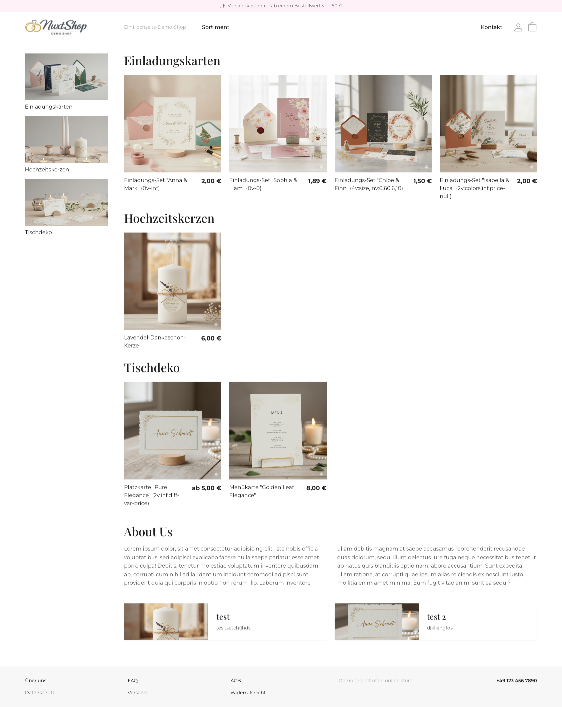
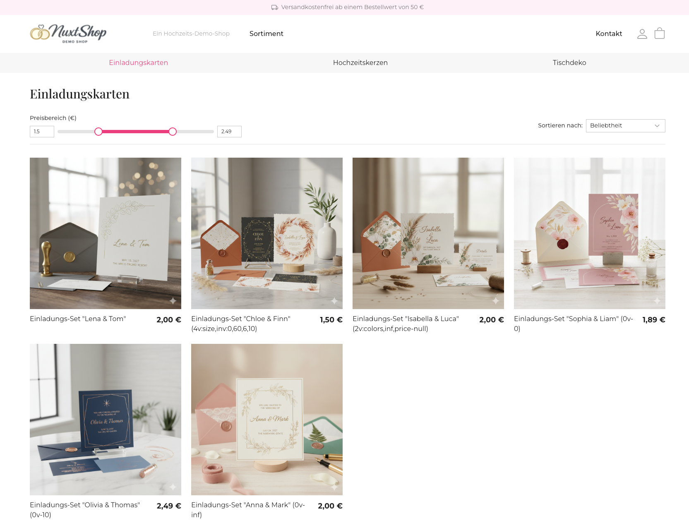
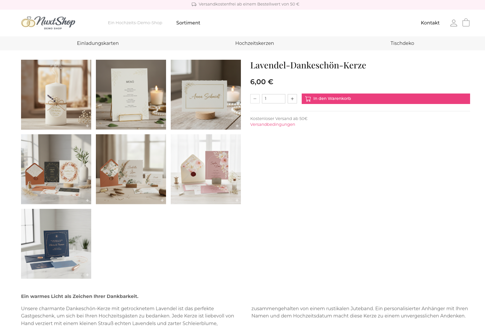
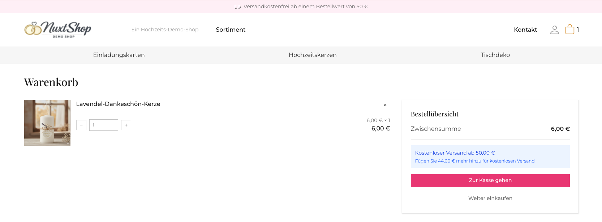
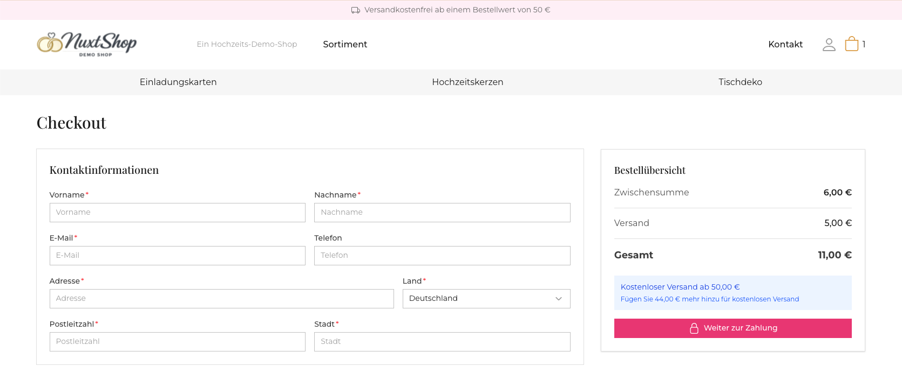
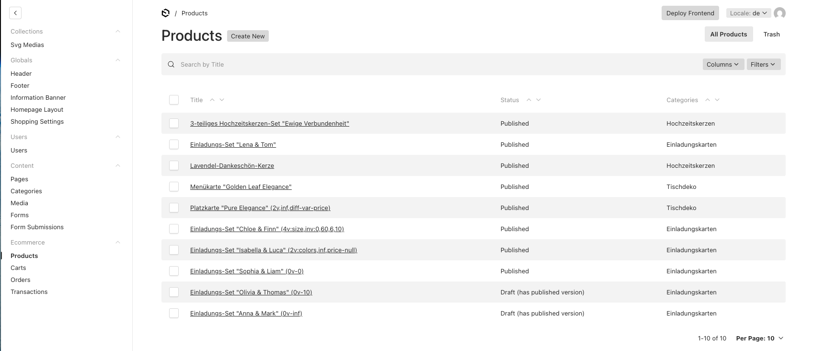
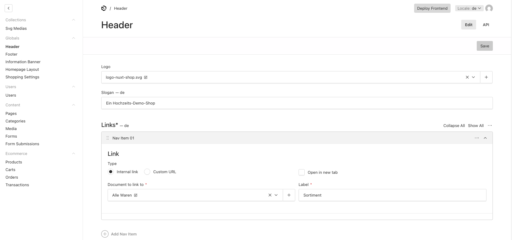

# Payload + Nuxt 3 E-commerce Demo

A modern, full-stack e-commerce demonstration built with **Payload CMS** (headless backend) and **Nuxt 3** (frontend).

🚀 **Live Demo:** [https://payload-vue-shop.vercel.app/](https://payload-vue-shop.vercel.app/)

### Frontend (Nuxt 4)






### Backend (Payload)



## Tech Stack

### Backend (`/payload`)
- **CMS:** Payload CMS (v3.0+)
- **Database:** PostgreSQL (Supabase)
- **API:** GraphQL & REST
- **Hosting:** Vercel (Serverless)

### Frontend (`/shop`)
- **Framework:** Nuxt 3 (Vue.js)
- **Styling:** Tailwind CSS + Nuxt UI
- **Data Fetching:** GraphQL
- **State Management:** Pinia

## Project Structure

This monorepo contains the following main directories:

- `payload/` - The backend CMS application. Manages products, categories, pages, and users.
- `shop/` - The frontend storefront application. Consumes data from Payload via GraphQL.
- *(Note: `storefront/` is a legacy version and should be ignored)*

## Getting Started

### Prerequisites
- Node.js (v18+)
- PostgreSQL database

### Installation

1.  **Clone the repository:**
    ```bash
    git clone https://github.com/your-username/payload-vue-shop.git
    cd payload-vue-shop
    ```

2.  **Setup Backend:**
    ```bash
    cd payload
    cp .env.example .env
    # Fill in your DATABASE_URI and PAYLOAD_SECRET
    npm install
    npm run dev
    ```

3.  **Setup Frontend:**
    ```bash
    # In a new terminal
    cd ../shop
    cp .env.example .env
    # Set NUXT_PUBLIC_PAYLOAD_URL=http://localhost:3000
    npm install
    npm run dev
    ```

## Features

- **Dynamic Content:** Pages, products, and categories managed via Payload CMS.
- **Custom Shop Settings:** Global settings for category ordering and featured products.
- **Responsive Design:** Mobile-first approach using Tailwind CSS.
- **Modern UI:** Built with Nuxt UI components.
- **SEO Friendly:** Server-side rendering (SSR) with Nuxt.
- **Payment:** Stripe.

## Deployment

The project is deployed on **Vercel** as two separate projects (Backend & Frontend).
- Backend runs as a Next.js application.
- Frontend runs as a Nuxt application.
